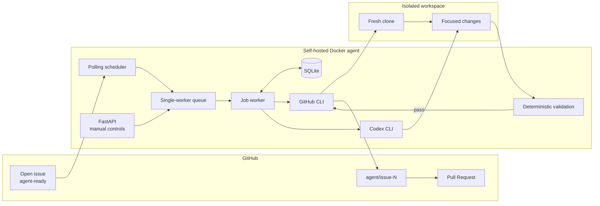
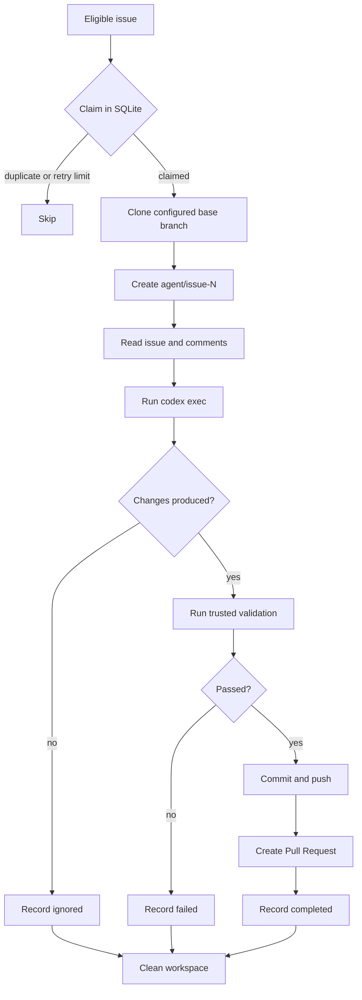

# Self-Hosted GitHub Issue Agent

A small Docker service that turns labeled GitHub issues into reviewed Pull
Requests:

```text
agent-ready issue -> Codex change -> validation -> agent branch -> Pull Request
```

It polls an explicit repository allowlist, gives each job a clean workspace,
stores job state in SQLite, and never merges automatically.

## Why this design

### Codex CLI instead of an OpenAI API integration

The worker invokes the locally installed Codex CLI with `codex exec`. When
Codex is authenticated with the operator's existing ChatGPT/Codex login, the
worker does not need an `OPENAI_API_KEY` or create separate token-metered API
usage.

This does not mean Codex is universally free or unlimited. An eligible account
or subscription is required, account limits still apply, and product terms may
change. Using API-key authentication instead would use that API account's
normal billing and limits.

### Polling instead of webhooks

Polling works on a private machine without exposing a public endpoint, tunnel,
or webhook secret. A manual scan is also available when immediate processing
is needed.

### SQLite and one worker

V1 intentionally executes one issue at a time. SQLite provides durable state,
deduplication, and restart recovery without Redis, queues, or additional
infrastructure.

### Pull Requests instead of automatic merges

Codex can make mistakes and repository validation cannot cover every behavior.
Successful changes are pushed only to `agent/issue-N`; a human remains
responsible for reviewing and merging the Pull Request.

## Security warning

This worker is privileged automation, not a security boundary. It can clone
code, run Codex, execute repository scripts, push branches, and create Pull
Requests with the permissions of the authenticated GitHub identity.

- Use a dedicated GitHub identity or least-privilege credential with access
  only to the configured repositories.
- Restrict who can add the `agent-ready` label. Applying it requests an
  automated code execution job.
- Treat issues, comments, repository files, dependencies, tests, and build
  scripts as potentially untrusted.
- Never mount the Docker socket, production credentials, SSH keys, cloud
  credentials, or secret-bearing host directories into the container.
- Keep the API private. It binds to `127.0.0.1` by default and V1 has no API
  authentication.
- Protect the Docker host and the persistent GitHub and Codex authentication
  volumes.
- Confirm that processing private source code with Codex is compatible with
  your organization's policies.
- Review every generated Pull Request and its CI results before merging.

## Architecture



## Job workflow



Authentication failures are recorded as `auth_required` and are not retried
indefinitely.

## Quick Start

### 1. Configure the repository

Edit `config.yaml`:

```yaml
poll_interval_seconds: 300
max_concurrent_jobs: 1
issue_label: agent-ready
workspace_root: /workspace
database_path: /data/agent.db
max_attempts: 2
command_timeout_seconds: 1800
codex_timeout_seconds: 3600
comment_on_failure: false
keep_workspace_on_failure: false

repos:
  - repo: owner/repository
    base_branch: develop
```

`base_branch` is the branch cloned for the job and used as the Pull Request
base. If it is omitted, GitHub's default repository branch is used.

Only repositories listed under `repos` can be scanned or submitted through the
API.

### 2. Configure local environment overrides

```bash
cp .env.example .env
```

The relevant defaults are:

```env
AGENT_BIND_ADDRESS=127.0.0.1
AGENT_PORT=8080
```

If port `8080` is already occupied, change `AGENT_PORT`, for example to `8081`.
Do not bind to `0.0.0.0` unless the API is protected by a firewall, private
network, or authenticated reverse proxy.

### 3. Build and start

```bash
docker compose build
docker compose up -d
```

### 4. Authenticate GitHub and Codex

```bash
docker compose exec agent gh auth login
docker compose exec agent codex login
```

Authentication is stored in named Docker volumes and survives container
restarts. The GitHub identity must be able to read the configured repository,
push an agent branch, and create a Pull Request.

Check authentication when needed:

```bash
docker compose exec agent gh auth status
docker compose exec agent codex login status
```

### 5. Restart after configuration changes

```bash
docker compose restart agent
```

### 6. Process an issue

Add the configured `agent-ready` label to an open issue. The scheduler will
detect it at the next polling interval, or a scan can be triggered immediately:

```bash
curl -X POST http://127.0.0.1:8080/scan
```

To submit one allowed issue directly:

```bash
curl -X POST http://127.0.0.1:8080/solve \
  -H 'Content-Type: application/json' \
  -d '{"repo":"owner/repository","issue":42}'
```

Replace `8080` when `AGENT_PORT` uses a different value.

### 7. Inspect progress

```bash
docker compose logs -f agent
curl http://127.0.0.1:8080/jobs
```

A successful job has `status: completed` and a `pr_url`. Open that URL to
review the generated summary, changed files, validation commands, and code.

## Configuration reference

| Setting | Default | Purpose |
| --- | --- | --- |
| `poll_interval_seconds` | `300` | Time between GitHub scans; minimum 10 seconds. |
| `max_concurrent_jobs` | `1` | Fixed to one in V1. |
| `issue_label` | `agent-ready` | Label required for polling. |
| `workspace_root` | `/workspace` | Root for isolated temporary clones. |
| `database_path` | `/data/agent.db` | Persistent SQLite database. |
| `max_attempts` | `2` | Maximum processing attempts per issue. |
| `command_timeout_seconds` | `1800` | Timeout for Git, GitHub, and validation commands. |
| `codex_timeout_seconds` | `3600` | Timeout for one Codex execution. |
| `comment_on_failure` | `false` | Post a generic failure comment on the issue. |
| `keep_workspace_on_failure` | `false` | Preserve failed workspaces for debugging. |

Repository entries accept:

```yaml
repos:
  - repo: owner/repository
    base_branch: develop
    validation_commands:
      - npm run test
      - npm run lint
```

Validation commands are trusted local configuration. They are split into
arguments and executed without `shell=True`; shell operators such as pipes and
redirections are not supported. Commands are never read from issue content.

## Automatic validation detection

When `validation_commands` is omitted, the worker selects commands from files
in the cloned repository:

| Repository file | Commands selected when applicable |
| --- | --- |
| `package.json` | Existing `test`, `lint`, and `build` npm scripts. |
| `pyproject.toml` with tests | `pytest` |
| `go.mod` | `go test ./...` |
| `*.tf` | `terraform fmt -check -recursive`, `terraform validate` |
| `*.pkr.hcl` | `packer fmt -check .`, `packer validate .` |

Validation fails closed when no command can be configured or detected. The
base image includes Python and Node/npm. Go, Terraform, Packer, or other tools
must be added to a derived image when a target repository needs them.

Target repositories should include an `AGENTS.md` with their setup, validation,
and contribution rules. Codex is explicitly instructed to read it before
editing.

## API

| Method | Endpoint | Purpose |
| --- | --- | --- |
| `GET` | `/health` | Service status and queued job count. |
| `GET` | `/jobs` | Persisted jobs and results. |
| `POST` | `/scan` | Scan every configured repository now. |
| `POST` | `/solve` | Queue one issue from an allowed repository. |

`POST /webhook/github` is not implemented in V1.

Job statuses are:

| Status | Meaning |
| --- | --- |
| `pending` | Accepted and waiting for the worker. |
| `running` | Claimed by the worker. |
| `failed` | Codex, Git, or validation failed. |
| `completed` | Branch pushed and Pull Request created. |
| `ignored` | Codex completed without repository changes. |
| `auth_required` | GitHub or Codex must be authenticated again. |

## Operational notes

- Each issue uses a unique `/workspace/owner-repo-N-<id>` directory.
- Workspaces are deleted after every job unless failed workspace retention is
  explicitly enabled.
- Existing jobs and Pull Requests are detected to prevent duplicate work.
- Branches always use `agent/issue-N`; direct pushes to `main` and `master` are
  rejected.
- A Pull Request is created only when changes exist and deterministic
  validation passes.
- SQLite data, workspaces, and authentication directories use persistent Docker
  volumes.
- V1 has no webhooks, automatic merge, multiple workers, remote API
  authentication, or arbitrary job cancellation.

## Troubleshooting

### Port already allocated

Set an unused host port in `.env`, then recreate the service:

```env
AGENT_PORT=8081
```

```bash
docker compose up -d --force-recreate
```

### Authentication required

Authenticate again, then submit the issue through `/solve`:

```bash
docker compose exec agent gh auth login
docker compose exec agent codex login
```

### No Pull Request was created

Inspect the persisted status and logs:

```bash
curl http://127.0.0.1:8080/jobs
docker compose logs --tail=200 agent
```

Common causes are missing authentication, no Codex changes, unavailable
validation tools, failed validation, a command timeout, or the retry limit.

## License

MIT
