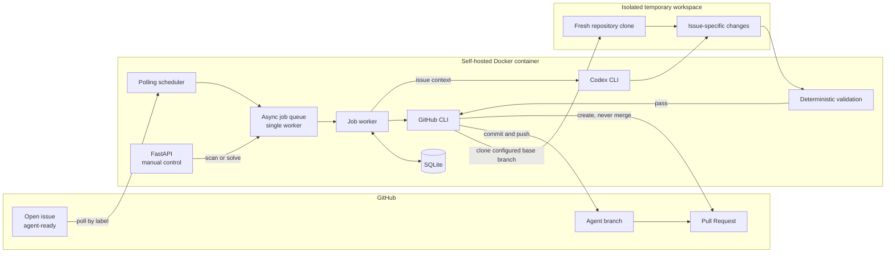
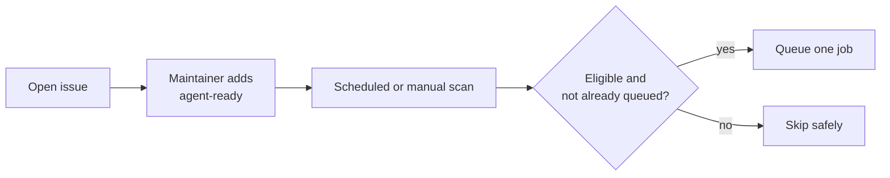
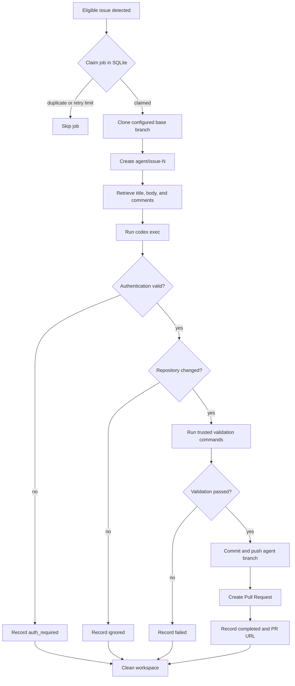
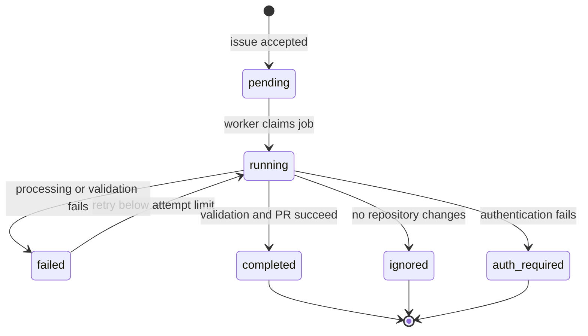

# Self-Hosted GitHub Issue Agent

A lightweight self-hosted agent that watches GitHub repositories for eligible issues, clones the repository, asks OpenAI Codex CLI to solve the issue, runs validation, and opens a Pull Request.

## Why this project uses Codex CLI

This project intentionally invokes the locally installed Codex CLI with
`codex exec`. It does not implement an OpenAI API integration and does not
require an `OPENAI_API_KEY` when Codex is authenticated with the existing
ChatGPT/Codex login.

The goal is to use the Codex access already available through the operator's
ChatGPT/Codex account instead of creating a separate token-metered OpenAI API
integration. This does not mean Codex usage is unlimited or universally free:
an eligible account or subscription is still required, account usage limits
still apply, and OpenAI product terms may change. If Codex is authenticated
with an API key instead, that API account's normal billing and limits apply.

## Security warning

This worker is privileged automation, not a security boundary. It can read
issue content, clone source code, run Codex, execute repository validation
commands, create commits, push branches, and open Pull Requests with the
permissions of the authenticated GitHub identity.

Run it only on a machine or VM you control, and assume that issue bodies,
comments, repository files, dependencies, build scripts, and test scripts may
be untrusted. Container isolation reduces accidental workspace contamination,
but the container still has network access and persistent GitHub and Codex
credentials.

Recommended operating rules:

- Use a dedicated GitHub identity or fine-grained credential with access only
  to the repositories this worker must modify.
- Do not grant organization administration, production deployment, package
  publishing, secrets management, or unrelated repository access.
- Restrict who can add the configured `agent-ready` label. Adding that label is
  equivalent to requesting an automated code execution job.
- Keep the repository allowlist small and review every configured repository.
- Do not mount the Docker socket, SSH keys, cloud credentials, production
  `.env` files, or host directories containing secrets into the container.
- Keep the FastAPI port private. V1 has no API authentication, so `/scan` and
  `/solve` must not be exposed directly to the internet or an untrusted LAN.
- Protect the Docker host and the named authentication volumes. Anyone who can
  access them may be able to reuse the stored credentials.
- Review every generated Pull Request and its CI results before merging. This
  project never merges automatically.
- Confirm that using Codex with private repository content is compatible with
  your organization's data handling and compliance requirements.

## Architecture



The agent is designed to run inside Docker on a personal computer, home server, VPS, or Linux VM.

## Goals

- Run as a Docker container.
- Authenticate GitHub with `gh`.
- Authenticate Codex CLI with a ChatGPT/Codex login.
- Monitor one or more GitHub repositories.
- Detect issues labeled `agent-ready`.
- Support polling, manual scans, and later GitHub webhooks.
- Clone each repository into a temporary workspace.
- Create one branch per issue.
- Invoke Codex CLI non-interactively.
- Run deterministic validation.
- Push successful changes and create a Pull Request.
- Keep state in SQLite.
- Process one issue at a time in V1.
- Never push directly to `main`.
- Never auto-merge in V1.

## Trigger model

Recommended trigger:

```text
agent-ready
```

Flow:



## Polling

Polling is the default for V1.

Every few minutes the agent searches configured repositories for open issues labeled `agent-ready`.

Advantages:

- no public endpoint required;
- works behind NAT;
- ideal for a home computer;
- pending issues are recovered when the computer comes back online;
- simpler than webhook infrastructure.

Suggested initial interval: 300 seconds.

## Webhooks

Add webhooks later for near-instant processing.

Recommended event:

```text
issues
action: labeled
label: agent-ready
```

If the machine runs at home, expose the endpoint through Cloudflare Tunnel, ngrok, or another HTTPS tunnel rather than direct port forwarding.

## Manual control

Suggested API:

```text
GET  /health
GET  /jobs

POST /scan
POST /solve
```

`POST /webhook/github` is intentionally reserved for a later release. Polling and
the two manual endpoints are the V1 trigger mechanisms.

## Configuration

Example `config.yaml`:

```yaml
poll_interval_seconds: 300
max_concurrent_jobs: 1
issue_label: agent-ready
workspace_root: /workspace

repos:
  - owner/backend-api
  - owner/another-service
  - owner/infrastructure
```

## Repository-specific instructions

Each target repo should ideally include `AGENTS.md`.

Example:

```md
# AGENTS.md

## Setup

npm install

## Validation

npm run lint
npm test
npm run build

## Rules

- Prefer the smallest safe change.
- Do not modify unrelated files.
- Add regression tests for bug fixes when appropriate.
- Do not change public APIs unless required by the issue.
- Do not introduce new dependencies unless necessary.
- Never commit credentials or secrets.
- Keep each Pull Request focused on one issue.
```

## Issue workflow



## Codex execution

Conceptually:

```bash
codex exec "
Read AGENTS.md first.

Solve GitHub issue #42.

Requirements:
- understand the root cause before editing
- make the smallest safe fix
- add regression tests when appropriate
- respect repository validation instructions
- do not modify unrelated code
- do not commit credentials or secrets
"
```

The wrapper remains responsible for Git operations, issue state, validation policy, retries, PR creation, logging, and cleanup.

Codex is responsible for reasoning about and editing the repository.

## Git workflow

Each issue gets a dedicated branch:

```text
agent/issue-42
```

After Codex completes, inspect the diff and run validation. If it passes:

```bash
git add .
git commit -m "fix: resolve issue #42"
git push origin agent/issue-42
```

Create the PR:

```bash
gh pr create   --repo owner/backend-api   --title "Fix #42"   --body "Closes #42"
```

## Validation

Codex should not be the only validator.

Examples:

### Node.js

```bash
npm test
npm run lint
npm run build
```

### Python

```bash
pytest
ruff check .
mypy .
```

### Go

```bash
go test ./...
go vet ./...
```

### Terraform

```bash
terraform fmt -check -recursive
terraform validate
tflint
```

### Packer

```bash
packer fmt -check .
packer validate .
```

The provided image includes Python and Node/npm tooling. Go, Terraform, Packer,
and any repository-specific validators must be added in a derived image when
those tools are needed; a missing validator causes validation to fail closed.

## Persisted job lifecycle

V1 uses SQLite.



SQLite preserves these states across container restarts and is enough because
V1 has one worker.

## Retry policy

Initial limits:

```text
max attempts per issue: 2
max concurrent jobs: 1
```

If an issue fails twice, mark it failed until manually retried.

## Authentication

Inside the container:

```bash
gh auth login
codex login
```

Persist GitHub CLI and Codex authentication directories as Docker volumes.

The authenticated GitHub identity defines the worker's effective permissions.
The repository allowlist limits what the application selects, but it does not
reduce the underlying token scopes. Prefer least-privilege GitHub access rather
than relying on the allowlist as the only control.

The default setup expects interactive `codex login` authentication backed by
the operator's ChatGPT/Codex account. It intentionally does not configure or
read an OpenAI API key.

The worker should detect authentication failures and mark the job `auth_required` instead of retrying forever.

## Suggested project structure

```text
issue-agent/
|
|-- src/
|   |-- main.py
|   |-- api.py
|   |-- worker.py
|   |-- scheduler.py
|   |-- github_client.py
|   |-- codex_runner.py
|   |-- git_service.py
|   |-- validation.py
|   |-- database.py
|   `-- models.py
|
|-- tests/
|-- config.yaml
|-- Dockerfile
|-- docker-compose.yml
|-- requirements.txt
|-- .env.example
|-- .gitignore
`-- README.md
```

## Docker Compose

Conceptual configuration:

```yaml
services:
  agent:
    build: .
    restart: unless-stopped

    ports:
      - "127.0.0.1:8080:8080"

    volumes:
      - agent-data:/data
      - agent-workspace:/workspace
      - agent-gh-config:/root/.config/gh
      - agent-codex-config:/root/.codex

    environment:
      CONFIG_FILE: /app/config.yaml
      DATABASE_URL: sqlite:////data/agent.db

volumes:
  agent-data:
  agent-workspace:
  agent-gh-config:
  agent-codex-config:
```

## Running

```bash
docker compose build
docker compose up -d
docker compose logs -f
```

First-time login:

```bash
docker compose exec agent gh auth login
docker compose exec agent codex login
```

## Quick Start

1. Build and start the service:

   ```bash
   docker compose build
   docker compose up -d
   ```

   The API listens on `127.0.0.1:8080` by default. If that port is occupied,
   set a different one in `.env` before starting, for example
   `AGENT_PORT=8081`, and use that port in the `curl` commands below.

   `AGENT_BIND_ADDRESS` defaults to `127.0.0.1` because V1 has no API
   authentication. Do not change it to `0.0.0.0` unless access is protected by
   a trusted firewall, private network, or authenticated reverse proxy.

2. Authenticate GitHub and Codex once. Their login directories are stored in
   named Docker volumes and survive container restarts:

   ```bash
   docker compose exec agent gh auth login
   docker compose exec agent codex login
   ```

3. Edit `config.yaml` and replace `owner/repository` with each allowed GitHub
   repository. The short form uses safe validation detection:

   ```yaml
   repos:
     - your-name/your-repository
   ```

   Trusted validation commands can instead be set explicitly per repository:

   ```yaml
   repos:
     - repo: your-name/your-repository
       base_branch: Stateless+Gracefull
       validation_commands:
         - pytest
         - ruff check .
   ```

   Commands are parsed as argument lists and run without a shell, so shell
   operators such as pipes and redirects are not supported. Apply configuration
   changes with:

   ```bash
   docker compose restart agent
   ```

4. Add the `agent-ready` label to an open issue in an allowed repository. Wait
   for the polling interval, or trigger a scan immediately:

   ```bash
   curl -X POST http://localhost:8080/scan
   ```

   A specific allowed issue can also be queued manually:

   ```bash
   curl -X POST http://localhost:8080/solve \
     -H 'Content-Type: application/json' \
     -d '{"repo":"your-name/your-repository","issue":42}'
   ```

5. Inspect service logs and persisted job state:

   ```bash
   docker compose logs -f agent
   curl http://localhost:8080/jobs
   ```

   A successful job reports `status: completed` and its `pr_url`. Open that URL
   to review the Pull Request; the agent never merges it.

## Implemented safety controls

V1 enforces:

- one worker only;
- explicit repository allowlist;
- only `agent-ready` issues;
- no direct pushes to protected branches;
- no automatic merge;
- no credentials bundled in the image or repository;
- no commands taken from issue text or comments;
- per-job isolated workspaces;
- maximum attempts;
- execution timeout;
- cleanup after each job;
- logs without credentials or tokens.

These controls do not make arbitrary repository code safe. Validation commands
come from trusted local configuration or conservative file-based detection, but
commands such as `npm test` and `pytest` execute code from the cloned
repository. Use a dedicated host or VM when processing repositories that are
not fully trusted. Webhooks and webhook signature verification are outside V1.

## Workspace isolation

Each job receives a unique directory:

```text
/workspace/owner-repo-42-<job-id>/
```

Delete it after completion.

Do not reuse dirty checkouts between issues.

## V1 scope

Use:

```text
Docker
Python
FastAPI
SQLite
Git
GitHub CLI
Codex CLI
Polling
Manual /scan
Manual /solve
Issue label filtering
Temporary clone
Codex execution
Validation
Branch creation
PR creation
```

Do not add in V1:

```text
Redis
RabbitMQ
Kafka
Kubernetes
LangChain
multi-agent orchestration
vector databases
complex dashboards
automatic merging
production AWS access
```

## Phase 2

After V1 is reliable:

- GitHub webhooks;
- Cloudflare Tunnel;
- webhook signature validation;
- richer per-repo configuration;
- multiple workers;
- job cancellation;
- better logs;
- PR reviewer agent;
- CI failure follow-up;
- automatic issue triage.

## Why Python?

Python is not mandatory.

The service could also be written in Go, TypeScript/Node.js, Rust, Java, or another general-purpose language.

Python is recommended for V1 because this application is mostly orchestration:

```text
HTTP
+
subprocess execution
+
GitHub API/CLI
+
SQLite
+
filesystem
+
background jobs
```

Python handles all of that with very little code.

This is not a high-throughput server. Most execution time will be spent waiting for GitHub, `git clone`, Codex inference, dependency installation, tests, and builds rather than executing Python.

For a single-worker personal daemon, Python performance is therefore unlikely to matter.

## Success criteria

V1 is successful when this works:

1. Create a GitHub Issue.
2. Add the `agent-ready` label.
3. Confirm the agent detects the issue.
4. Confirm the repository is cloned from the configured base branch.
5. Let Codex investigate and produce a focused change.
6. Require deterministic validation to pass.
7. Confirm the `agent/issue-N` branch is pushed.
8. Review the generated Pull Request and validation summary.
9. Let a human decide whether to merge.

Everything after that is an optimization.

## License

MIT
